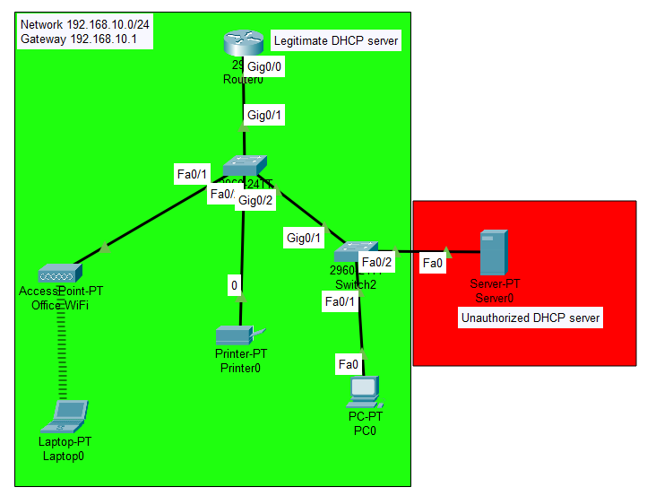
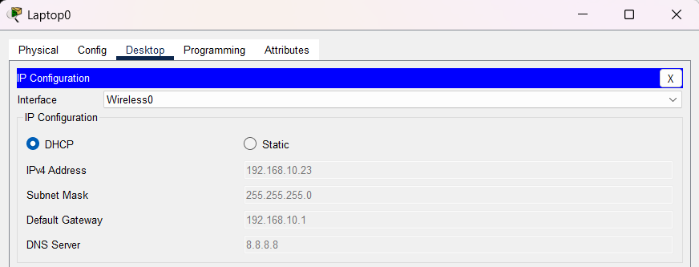
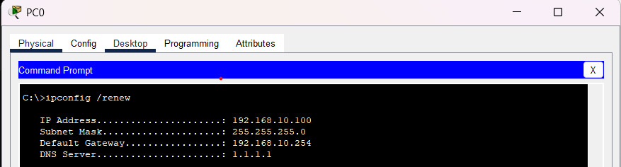
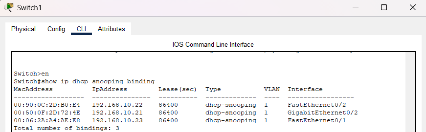
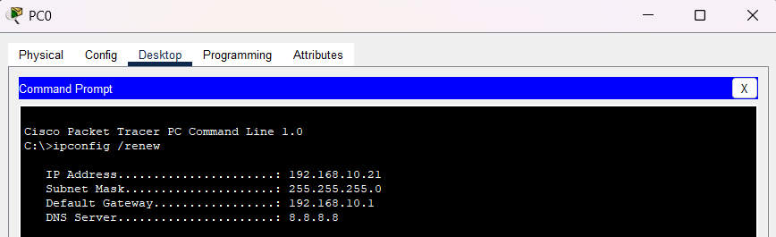

# DHCP Snooping & Rogue DHCP Protection

## Objective

The objective of this lab was to understand how DHCP Snooping protects enterprise networks from unauthorized DHCP servers and ensures that clients receive IP configurations only from trusted DHCP sources.

---

# Network Scenario

This lab simulated a small office environment where devices obtain their IP addresses automatically through DHCP.

The network consisted of:

- Router acting as the legitimate DHCP server
- Core switch enforcing DHCP Snooping
- Access switch
- Wireless Access Point
- Employee laptop connected through Wi-Fi
- Desktop workstation
- Network printer
- Rogue device attempting to provide unauthorized DHCP services

The goal was to observe the impact of a rogue DHCP server and then use DHCP Snooping to prevent unauthorized DHCP responses.

---

# Topology



---

# Network Design

| Device | Role |
|----------|----------|
| R1 | Legitimate DHCP Server |
| SW1 | Core Switch (DHCP Snooping) |
| SW2 | Access Switch |
| AP1 | Wireless Access Point |
| Laptop | Employee Device |
| PC2 | Wired Workstation |
| Printer | Network Printer |
| Rogue-PC | Unauthorized DHCP Server |

---

# Legitimate DHCP Configuration

The router was configured to provide:

- IP addresses
- Default gateway
- DNS server information


```bash
ip dhcp pool OFFICE

network 192.168.10.0 255.255.255.0

default-router 192.168.10.1

dns-server 8.8.8.8
```


---

# Wireless Connectivity

To better represent a real office environment, the administrator laptop connected to the network through a wireless access point rather than a direct cable connection.

This demonstrated how wireless and wired infrastructure coexist while sharing centralized network services.



---

# Rogue DHCP Attack Simulation

A rogue workstation was configured to provide DHCP services on the same network.

This resulted in clients potentially receiving:

- Incorrect default gateway
- Incorrect DNS information
- Incorrect network configuration

which can lead to connectivity issues or traffic interception.



---

# DHCP Snooping Implementation

DHCP Snooping was enabled on the core switch.

```bash
ip dhcp snooping
ip dhcp snooping vlan 1
```

The router-facing interface was configured as trusted.

```bash
interface g0/1
ip dhcp snooping trust
```

This allowed DHCP responses only from the legitimate DHCP server.

---

# Verification

Verified DHCP Snooping operation using:

```bash
show ip dhcp snooping
```

and

```bash
show ip dhcp snooping binding
```

The binding table recorded:

- MAC addresses
- Assigned IP addresses
- VLAN information
- Interface mappings



---

# Connectivity Testing

After DHCP Snooping was enabled, clients consistently received valid IP configurations from the authorized DHCP server.



---

# Troubleshooting

## Issue

After enabling DHCP Snooping, none of the clients were able to obtain an IP address.

Investigation using:

```bash
show ip dhcp snooping
```

revealed that no interfaces had been configured as trusted.

As a result, the switch was blocking DHCP responses from both the rogue device and the legitimate router.

## Resolution

Configured the router-facing interface as trusted:

```bash
interface g0/1
ip dhcp snooping trust
```

Once trusted, DHCP leases were successfully issued again.

---

# What I Learned

- How DHCP operates in enterprise networks
- Risks associated with rogue DHCP servers
- How DHCP Snooping filters unauthorized DHCP traffic
- Trusted vs untrusted interfaces
- DHCP Snooping binding tables
- Layer 2 security concepts
- Real-world DHCP troubleshooting techniques

---

# Files Included

- Packet Tracer lab
- Configuration file
- Verification outputs
- Network screenshots
