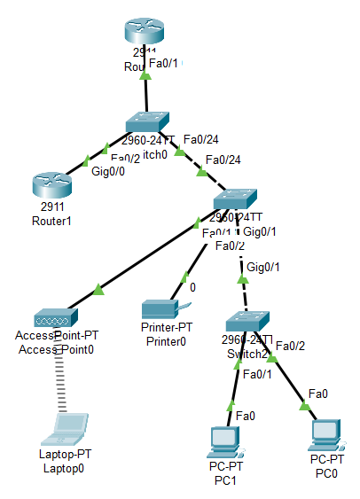
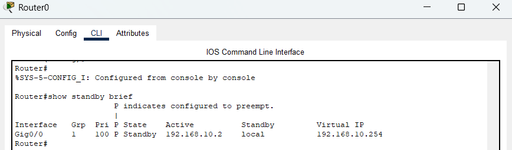
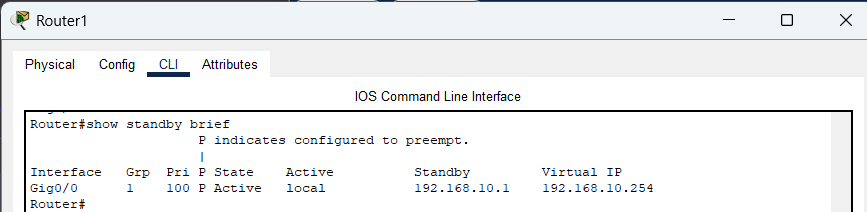
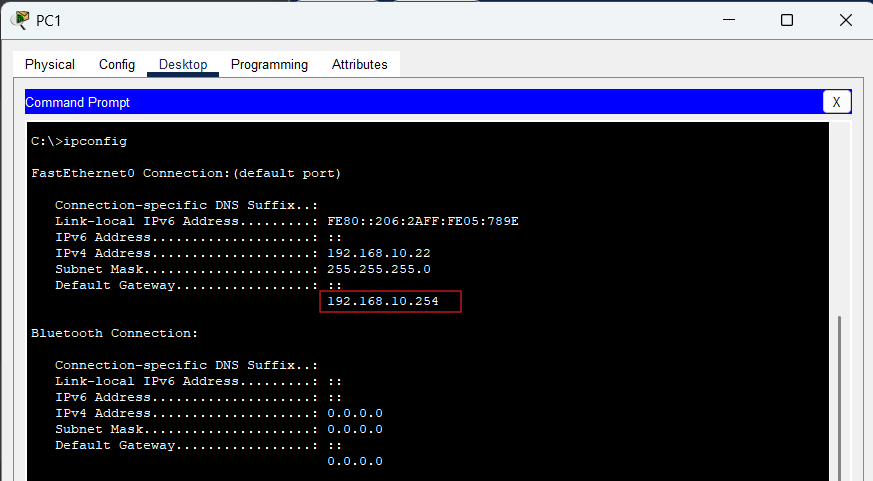
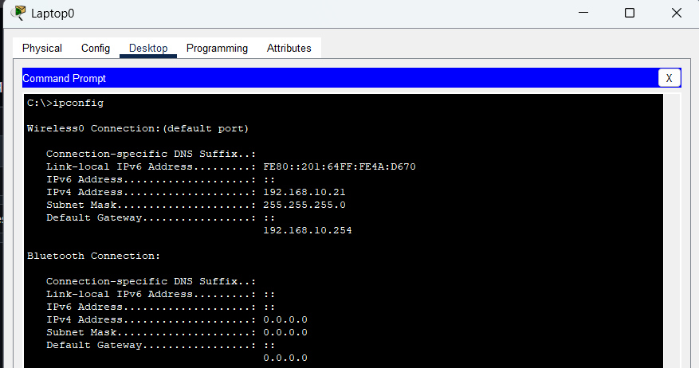
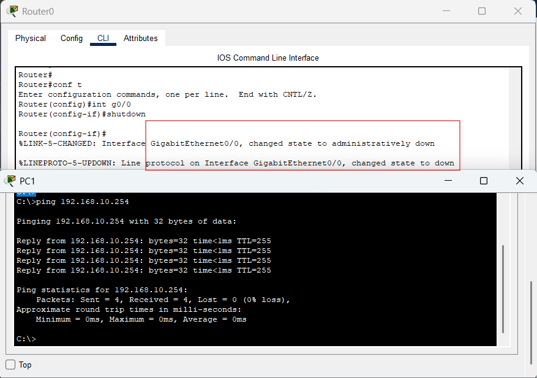

# HSRP Gateway Redundancy

## Objective

The objective of this lab was to understand how Hot Standby Router Protocol (HSRP) provides gateway redundancy and helps eliminate a single point of failure within a network.

The lab simulated a small business environment where multiple users relied on a default gateway for network communication. By implementing HSRP, network availability could be maintained even if the primary router became unavailable.

---

# Network Scenario

This lab simulated a small office network consisting of:

- Two routers
- Core switch
- Access switches
- Wireless access point
- Employee laptop
- Desktop workstations
- Network printer

The goal was to provide uninterrupted gateway availability using HSRP.

Instead of configuring clients to use a physical router address, clients were configured to use a virtual gateway shared between both routers.

---

# Topology



---

# Network Design

| Device | Role |
|----------|----------|
| R0 | Primary Router (Active HSRP) |
| R1 | Backup Router (Standby HSRP) |
| SW0 | Core Switch |
| SW1 | Access Switch |
| SW2 | Access Switch |
| AP0 | Wireless Connectivity |
| Laptop | Wireless Client |
| PC0 | Wired Client |
| PC1 | Wired Client |
| Printer | Network Printer |

---

# Addressing

| Device | IP Address |
|----------|----------|
| R1 | 192.168.10.1 |
| R2 | 192.168.10.2 |
| HSRP Virtual IP | 192.168.10.254 |

Clients were configured to use:

192.168.10.254

as the default gateway.

---

# HSRP Configuration

## Router 1

```bash
interface g0/0

standby 1 ip 192.168.10.254

standby 1 priority 110

standby 1 preempt
```

Router 1 was configured with a higher priority, allowing it to become the Active router.



---

## Router 2

```bash
interface g0/0

standby 1 ip 192.168.10.254

standby 1 priority 100

standby 1 preempt
```

Router 2 operated as the Standby router.



---

# Verification

Verified HSRP operation using:

```bash
show standby brief
```

Confirmed:

- Active router election
- Standby router election
- Shared virtual IP
- HSRP group operation

---

# DHCP Integration

Clients obtained addresses automatically through DHCP.

The DHCP pool distributed:

```bash
default-router 192.168.10.254
```

rather than the physical address of either router.

This ensured gateway continuity regardless of which router was active.



---

# Wireless Connectivity

To better simulate a real office environment, a wireless access point was included and a laptop connected through Wi-Fi.

This demonstrated that both wired and wireless clients could use the same virtual gateway.



---

# Failover Testing

After confirming normal operation, Router 1 was intentionally shut down.

```bash
interface g0/0
shutdown
```

HSRP automatically promoted Router 2 from Standby to Active status.

No changes were required on client devices.

Connectivity remained operational through the virtual gateway.



---

# Verification After Failure

Verified successful failover using:

```bash
show standby brief
```

Router 2 successfully assumed the Active role.

---

# Troubleshooting

## Issue

A mismatch was intentionally introduced using different HSRP group numbers on the routers.

Example:

Router 1:

```bash
standby 1 ip 192.168.10.254
```

Router 2:

```bash
standby 2 ip 192.168.10.254
```

## Result

The routers did not properly form an HSRP pair.

Both routers operated independently instead of participating in the same redundancy group.

## Resolution

Configured matching HSRP group numbers on both routers.

```bash
standby 1 ip 192.168.10.254
```

HSRP operation returned to normal.


---

# What I Learned

- Purpose of First Hop Redundancy Protocols
- How HSRP provides gateway redundancy
- Active and Standby router roles
- Virtual IP addresses
- HSRP priorities and elections
- Preemption behavior
- Failover mechanisms
- High availability concepts
- Gateway redundancy troubleshooting

---

# Files Included

- Packet Tracer lab
- Configuration file
- Verification outputs
- Troubleshooting evidence
- Network screenshots
