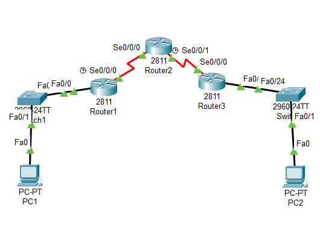
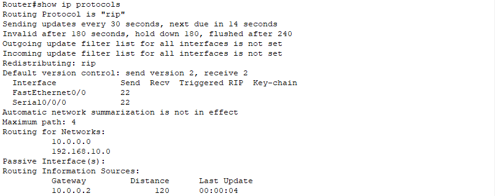
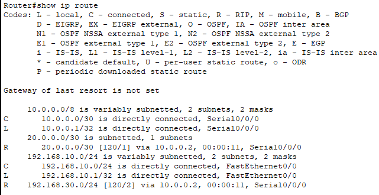
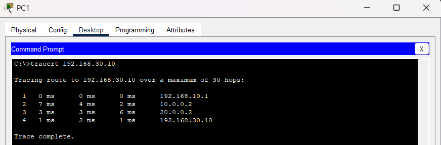

RIP Dynamic Routing

## Objective
The objective of this lab was to configure dynamic routing using RIP version 2 (RIPv2) to enable automatic route exchange between multiple routers.

---

# Topology



---

# Network Scenario

This lab simulated communication between multiple office locations connected through WAN links using dynamic routing.

The topology included:
- Three routers
- Multiple LAN networks
- Serial WAN connections
- RIP version 2 configuration
- Automatic route learning
- Routing verification and troubleshooting

---

# IP Addressing

| Device | Interface | IP Address |
|--------|-----------|------------|
| PC1 | Fa0 | 192.168.10.10 |
| R1 | G0/0 | 192.168.10.1 |
| R1 | S0/0/0 | 10.0.0.1 |
| R2 | S0/0/0 | 10.0.0.2 |
| R2 | S0/0/1 | 20.0.0.1 |
| R3 | S0/0/0 | 20.0.0.2 |
| R3 | G0/0 | 192.168.30.1 |
| PC2 | Fa0 | 192.168.30.10 |

---

# RIP Configuration

## Router1

```bash
router rip
version 2
no auto-summary

network 192.168.10.0
network 10.0.0.0
```

---

## Router2

```bash
router rip
version 2
no auto-summary

network 10.0.0.0
network 20.0.0.0
```


## Router3

```bash
router rip
version 2
no auto-summary

network 20.0.0.0
network 192.168.30.0
```


---

# RIP Verification

Verified RIP operation and automatic route exchange using routing verification commands.

```bash
show ip protocols
show ip route
```



---

# Routing Table Analysis

Observed dynamically learned routes marked with:

```text
R
```

inside routing tables.



---

# Connectivity Testing

Verified successful communication between remote LAN networks using ping tests.


---

# Traceroute Verification

Used traceroute to observe packet traversal through multiple routers across the WAN topology.



---

# Troubleshooting

## Issues Tested
- Missing RIP network statements
- Interface shutdown states
- Incorrect RIP advertisements
- Route propagation failures

## Resolution
Verified routing protocol operation, interface states, and learned routes using RIP verification commands.

---

# What I Learned
- Difference between static and dynamic routing
- How RIP automatically exchanges routes
- How routers learn remote networks dynamically
- RIP hop-count metric behavior
- Basic routing protocol troubleshooting techniques

---

# Files Included
- Packet Tracer lab
- Configuration file
- Verification screenshots
- Troubleshooting screenshots
