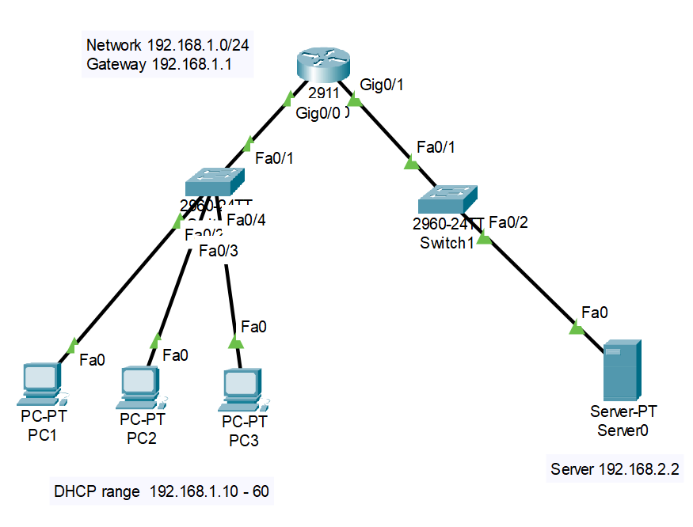
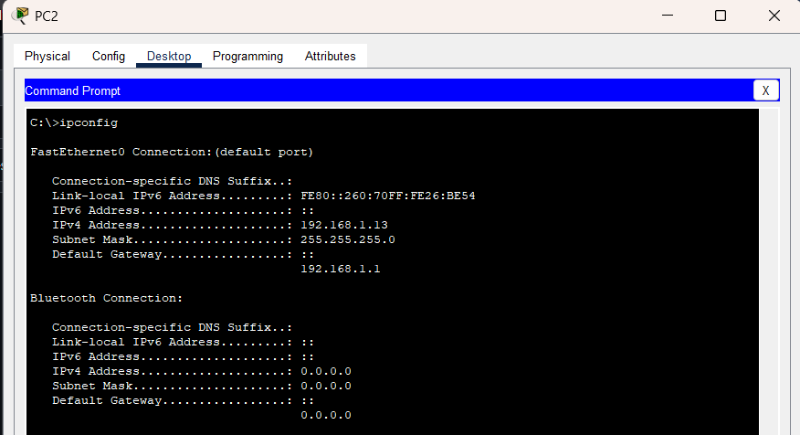
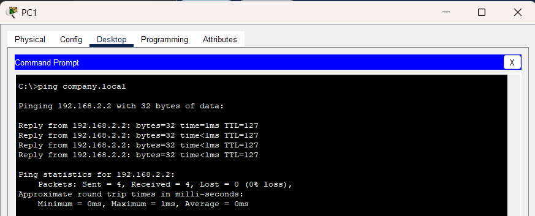
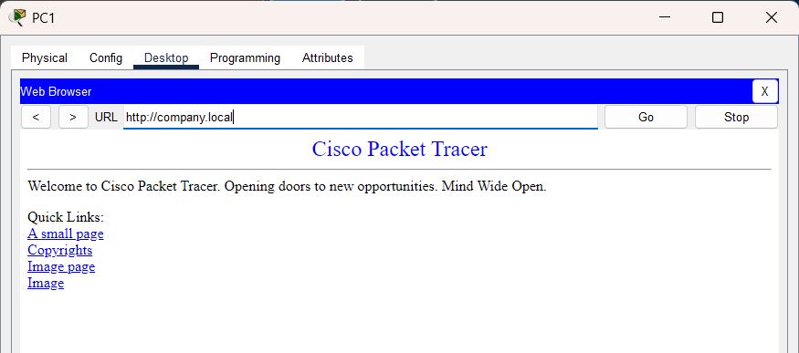

# DHCP + DNS Lab - Two Network Design

## Objective
To design a network with separate client and server segments, implementing DHCP for automatic IP assignment and DNS for name resolution across networks.

## Topology
- 1 Router
- 2 Switches
- 1 Server (DHCP + DNS + HTTP)
- 3 Client PCs

 
## Network Design

### Client Network
- Network: 192.168.1.0/24
- Gateway: 192.168.1.1

### Server Network
- Network: 192.168.2.0/24
- Server IP: 192.168.2.2

## Configuration Summary

### Router
- Configured two interfaces for separate networks
- Enabled DHCP relay using `ip helper-address`

### Server
- Static IP configuration
- DHCP service for client network
- DNS service for domain resolution
- HTTP service for web access

### Clients
- Configured to obtain IP automatically using DHCP

## Testing

### IP Assignment

### DNS Resolution

### Web Access

## Troubleshooting

### Issue:
Clients were not receiving IP addresses

### Cause:
Missing DHCP relay configuration on router

### Fix:
Configured `ip helper-address` to forward DHCP requests to the server

## Key Learnings
- DHCP can operate across networks using relay  
- DNS enables name-based communication  
- Network services depend on correct routing and configuration  

## ✅ Result
Successfully implemented a multi-network design with DHCP and DNS services.
