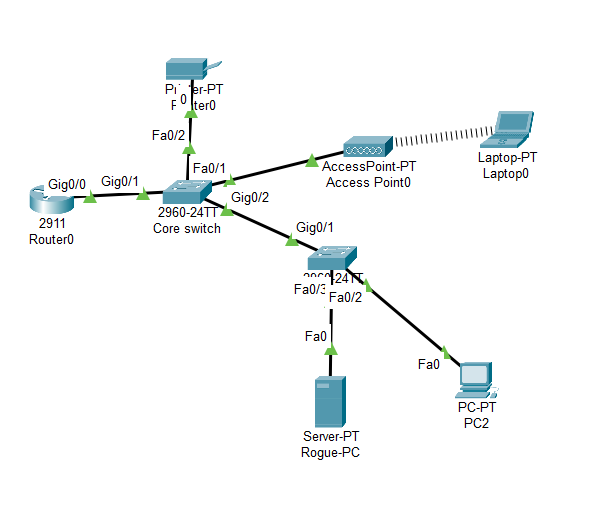
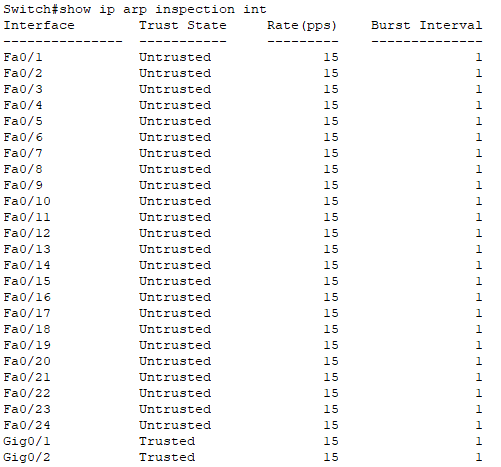
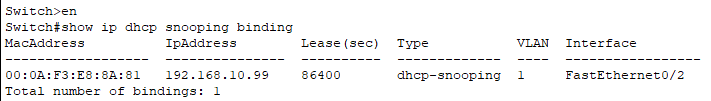
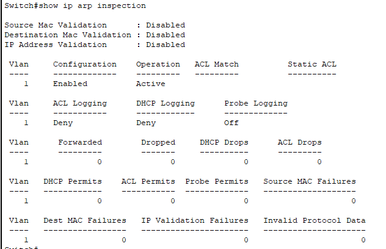
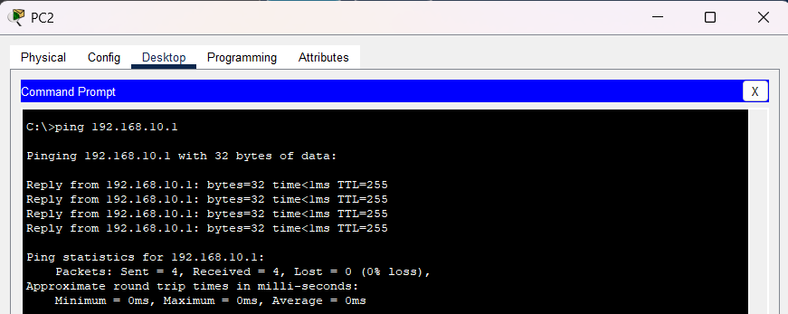

# Day 16 - Dynamic ARP Inspection (DAI)

## Objective

The objective of this lab was to understand how ARP functions within a network, how ARP spoofing attacks are performed, and how Dynamic ARP Inspection (DAI) can be used to validate ARP traffic and mitigate spoofing attempts.

---

# Network Scenario

This lab simulated a small office network consisting of wired and wireless clients, a centralized DHCP server, and multiple switches.

The network included:

- Router acting as the default gateway and DHCP server
- Core switch
- Access switch
- Wireless access point
- Employee laptop
- Desktop workstation
- Network printer
- Simulated attacker workstation

The goal was to understand how attackers can manipulate ARP traffic and how enterprise switches use Dynamic ARP Inspection to validate ARP packets before forwarding them.

---

# Topology



---

# Understanding ARP

Before implementing DAI, the lab focused on understanding the Address Resolution Protocol (ARP).

ARP is responsible for mapping IP addresses to MAC addresses so that devices can communicate on a local network.

Example:

```text
192.168.10.1
↓
00E0.F7AA.1234
```

Without ARP, devices would know destination IP addresses but would not know where to send Ethernet frames.



---

# ARP Spoofing

The lab also explored how attackers abuse ARP through spoofing attacks.

In an ARP spoofing attack, an attacker sends forged ARP replies to convince devices that the attacker's MAC address belongs to another device, commonly the default gateway.

Example:

```text
Gateway IP:
192.168.10.1

Real MAC:
00E0.F7AA.1234

Attacker Claims:
192.168.10.1 = 00AA.BBCC.DDEE
```

This can allow attackers to intercept, monitor, or manipulate traffic.

---

# DHCP Snooping Dependency

Dynamic ARP Inspection relies on DHCP Snooping.

DAI validates ARP packets using information stored in the DHCP Snooping Binding Table.

Verified bindings using:

```bash
show ip dhcp snooping binding
```



---

# Dynamic ARP Inspection Configuration

Enabled DAI for VLAN 1:

```bash
ip arp inspection vlan 1
```

Configured trusted interfaces toward the router and switch uplinks.

Example:

```bash
interface g0/1
ip arp inspection trust
```

---

# Verification

Verified DAI operation using:

```bash
show ip arp inspection

show ip arp inspection interfaces
```

Confirmed:

- DAI enabled
- Trusted interfaces configured
- DHCP Snooping integration functioning



---

# Connectivity Testing

Verified normal communication between clients and the default gateway after DAI implementation.

This confirmed that legitimate ARP traffic was being permitted while inspection remained active.



---

# Troubleshooting

## Issue Encountered

While preparing the environment for DAI, DHCP clients connected to the access switch failed to obtain IP addresses after DHCP Snooping was enabled.

Investigation included:

- Verifying trusted interfaces
- Reviewing DHCP Snooping configuration
- Testing DHCP behavior across both switches
- Validating DHCP server functionality

The root cause was identified as DHCP Snooping Option 82 insertion.

## Resolution

Disabled DHCP Snooping information option:

```bash
no ip dhcp snooping information option
```

After disabling Option 82 insertion on the core switch, DHCP clients successfully obtained addresses from the legitimate DHCP server and DAI deployment proceeded successfully.


---

# Trusted Interfaces

Verified trusted infrastructure links using:

```bash
show ip arp inspection interfaces
```

Trusted interfaces included:

- Router uplink
- Switch uplink

Client-facing interfaces remained untrusted.

---

# What I Learned

- How ARP operates within a local network
- The purpose of ARP requests and replies
- How ARP spoofing attacks work
- Why ARP spoofing can lead to traffic interception
- How Dynamic ARP Inspection validates ARP traffic
- The relationship between DAI and DHCP Snooping
- Trusted vs untrusted interfaces
- Enterprise Layer 2 security concepts
- Troubleshooting DHCP Snooping and DAI dependencies

---

# Files Included

- Packet Tracer lab
- Configuration file
- Verification outputs
- Network screenshots
