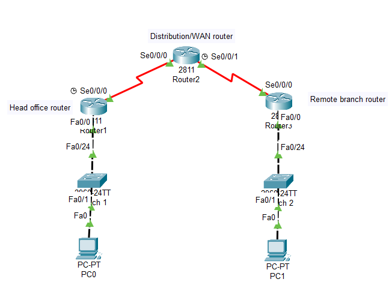
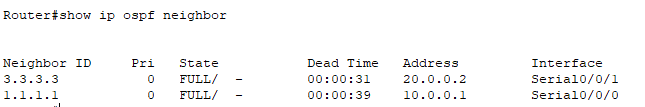
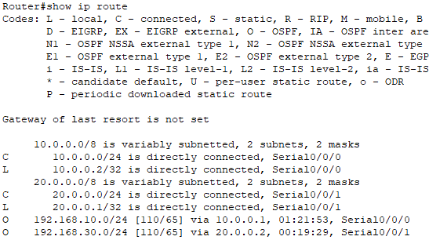
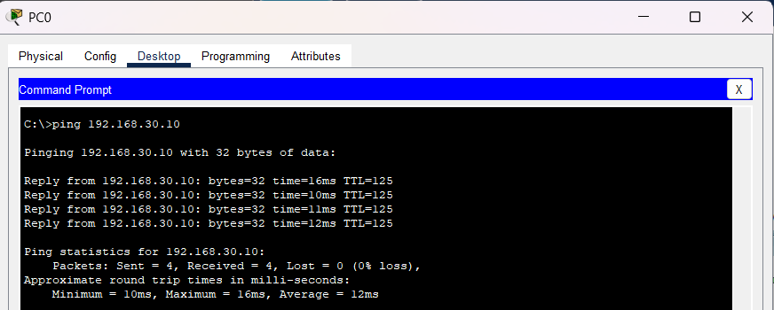
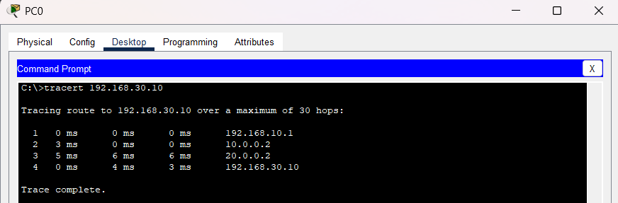

# OSPF Dynamic Routing

## Objective
The objective of this lab was to configure OSPF dynamic routing between multiple routers to enable automatic route exchange and scalable enterprise-style routing.

---

# Topology



---

# Network Scenario

This lab simulated communication between multiple office locations connected through WAN links using OSPF dynamic routing.

The topology included:
- Three routers
- Multiple LAN segments
- Serial WAN links
- OSPF neighbor relationships
- Automatic route learning
- Routing verification and troubleshooting

---

# IP Addressing

| Device | Interface | IP Address |
|--------|-----------|------------|
| PC1 | Fa0 | 192.168.10.10 |
| R1 | G0/0 | 192.168.10.1 |
| R1 | S0/0/0 | 10.0.0.1 |
| R2 | S0/0/0 | 10.0.0.2 |
| R2 | S0/0/1 | 20.0.0.1 |
| R3 | S0/0/0 | 20.0.0.2 |
| R3 | G0/0 | 192.168.30.1 |
| PC2 | Fa0 | 192.168.30.10 |

---

# OSPF Configuration

## Router1

```bash
router ospf 1
router-id 1.1.1.1

network 192.168.10.0 0.0.0.255 area 0
network 10.0.0.0 0.0.0.3 area 0
```
---

## Router2

```bash
router ospf 1
router-id 2.2.2.2

network 10.0.0.0 0.0.0.3 area 0
network 20.0.0.0 0.0.0.3 area 0
```

---

## Router3

```bash
router ospf 1
router-id 3.3.3.3

network 20.0.0.0 0.0.0.3 area 0
network 192.168.30.0 0.0.0.255 area 0
```

---

# OSPF Neighbor Verification

Verified OSPF neighbor relationships using:

```bash
show ip ospf neighbor
```

Observed FULL neighbor adjacency states between routers.



---

# Routing Table Analysis

Verified dynamically learned OSPF routes using:

```bash
show ip route
```

Observed routes marked with:

```text
O
```

inside the routing table.



---

# Connectivity Testing

Verified successful communication between remote LAN networks using ping tests.



---

# Traceroute Verification

Used traceroute to observe packet traversal across multiple routers within the OSPF topology.



---

# Troubleshooting

## Issues Tested
- Incorrect OSPF area assignments
- Duplicate router IDs
- Interface shutdown states
- OSPF neighbor adjacency failures

## Resolution
Verified neighbor relationships, routing tables, and OSPF configurations using routing protocol verification commands.


---

# What I Learned
- Difference between RIP and OSPF
- How OSPF neighbor relationships work
- OSPF area concepts
- Router ID importance
- How OSPF dynamically exchanges routes
- Enterprise routing troubleshooting techniques

---

# Files Included
- Packet Tracer lab
- Configuration file
- Verification screenshots
- Troubleshooting screenshots
